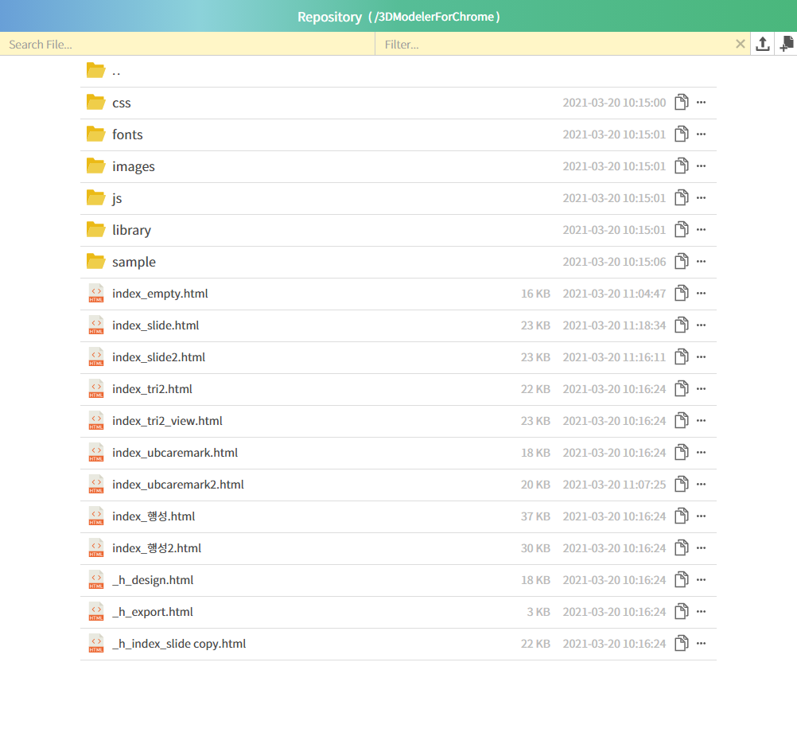

# simple-web-explorer
This is a web file explorer like windows explorer.  
simple-web-explorer is made for sharing files and viewing images easily.
It's very useful and convenient sharing with coworkers on web.

```bash
$ npm install yarn -g && yarn install
```

To build, 

```bash
$ yarn build
```

To start,

```bash
yarn start
```

  


