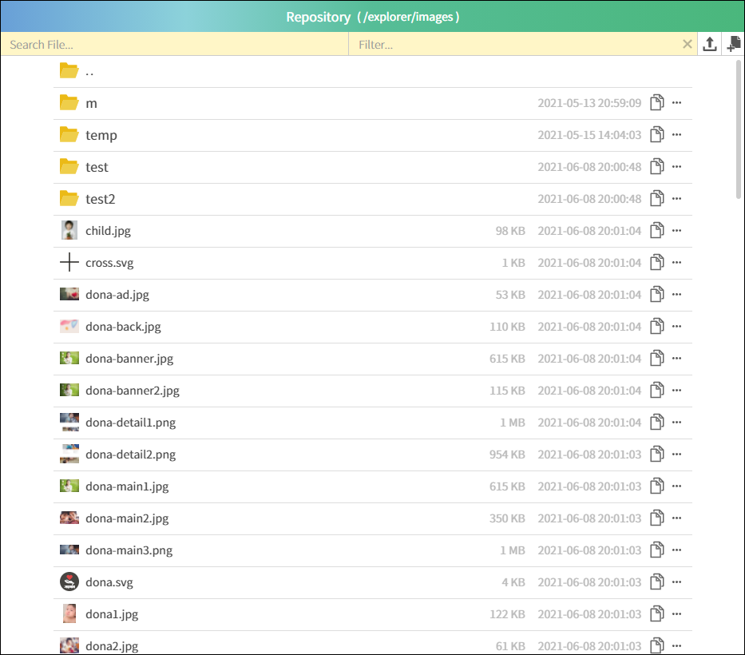

# Simple Web Explorer

   

This is a web file explorer like windows explorer.  
simple-web-explorer is made for sharing files and viewing images easily.
It's very useful and convenient sharing with coworkers on web.

> **NOTE:** I recommend using cloud services like google drive, onedrive, iclound
> because this is for local environment

To install packages

```bash
$ yarn
```

To build client, 

```bash
$ yarn build
```

You have to set root storage folder in config.dev.js or config.prod.js
```js
// in config.dev.js or config.prod.js
module.exports = {
   ...
   rootStorage: 'root folder path',
   ...
}
```
There are 3 options to be required if you want to use login, 
```js
// in config.dev.js or config.prod.js
module.exports = {
   ...
   useLogin: true,            // enable login
   sessionExpireMinutes: 60,  // session timeout
   mongo: { connStr: `mongodb:///192.168.0.123`, options: { useUnifiedTopology: true, connectTimeoutMS: 180000, socketTimeoutMS: 120000 } }, // mongo connection
   ...
}
```

To start server,

```bash
yarn start
```

Then you can see below,

For production
[http://localhost](http://localhost)

For development
[http://localhost:10001](http://localhost:10001)
  


